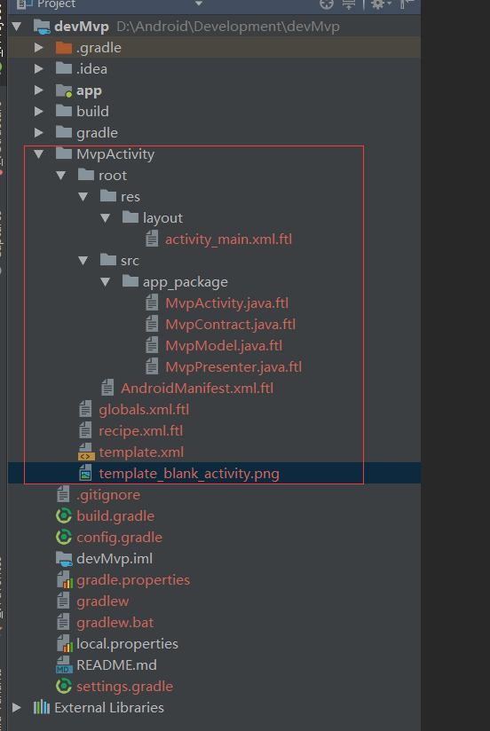
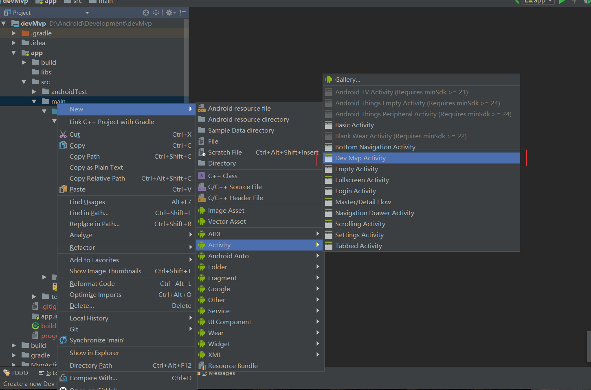

# devMvp
#### 项目采用 RxJava2+Mvp+Mvp代码模板
#### 使用方法
##### 此项目MVP架构比较简洁易上手，使用方法在代码里面都会有相关注释，具体可以看代码
#### 模板使用方法
##### Copy项目下的MvpActivity文件夹到Android Studio安装目录  C:\Android\Android Studio 3.0 release\plugins\android\lib\templates\activities文件夹下，文件夹下面的 .ftl后缀文件可以根据自己的需求更改，文件修改方法里面都会有注释。
 

####  生成模板

